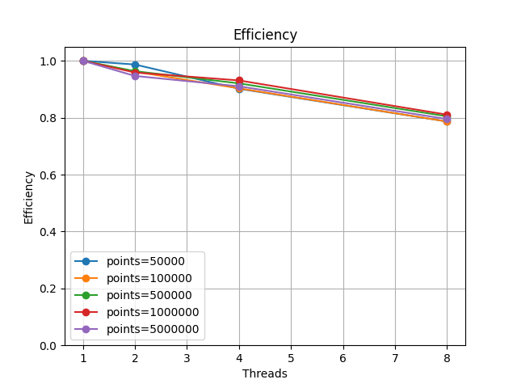
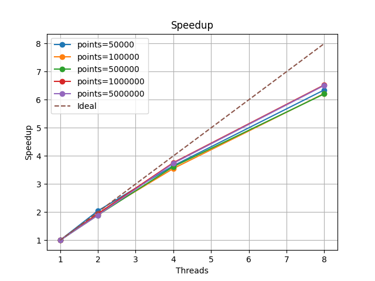
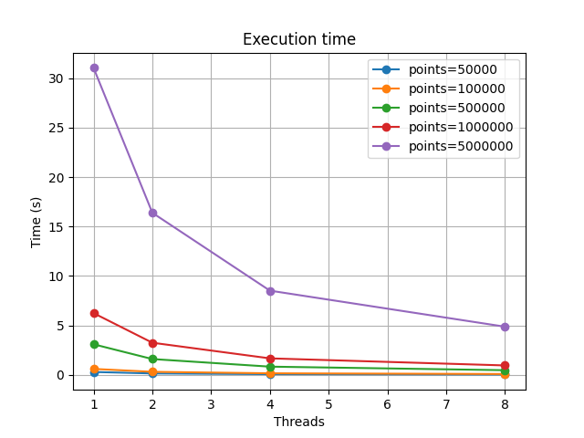
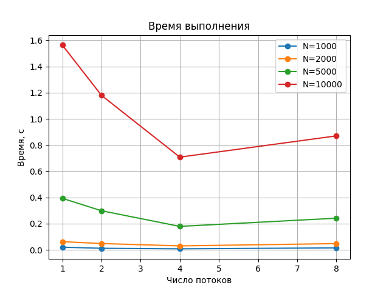
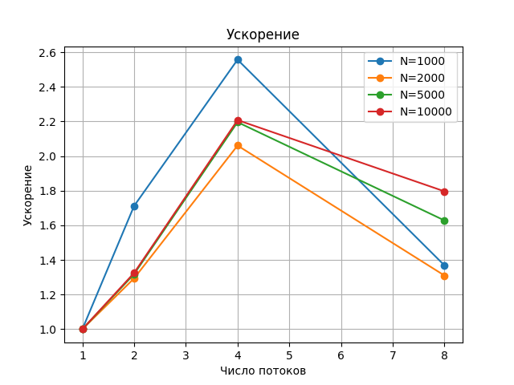

# MPI_Lab2

Все замеры были выполнены на ARM архитектуре, процессор Apple Silicon M4.

## Task 1. Множество Мандельброта

Запуск:
- ./run.sh
- python3 plot.py (для графиков, перед этим можно установить requirements)

В этой задаче реализовано параллельное вычисление точек множества Мандельброта с использованием OpenMP. Алгоритм основан на стохастическом подходе: точки равномерно случайно генерируются в прямоугольной области комплексной плоскости, после чего для каждой точки проверяется принадлежность множеству Мандельброта стандартной итерационной формулой. Точка считается принадлежащей множеству, если за фиксированное число итераций значение не выходит за радиус 2.

Основная вычислительная нагрузка сосредоточена в функции is_in_mandelbrot, где выполняются итерации комплексного отображения. Для каждой требуемой точки алгоритм повторяет генерацию случайных координат до тех пор, пока не будет найдена точка, принадлежащая множеству.

Параллелизация выполнена по числу генерируемых точек. Внутри параллельной области используется директива omp for с динамическим расписанием и минимальным размером чанка, что позволяет эффективно балансировать нагрузку между потоками, поскольку разные точки могут требовать разного количества попыток и итераций. Для генерации случайных чисел применяется rand_r с отдельным seed для каждого потока, что устраняет гонки данных и обеспечивает корректную работу в многопоточном режиме.

Программа принимает в качестве аргументов командной строки количество потоков и количество точек. Для измерения времени выполнения вычисления запускаются несколько раз (по умолчанию 5), после чего выводится среднее время, что снижает влияние флуктуаций, связанных с планировщиком и системой.

Экспериментальные результаты показывают хорошую масштабируемость: при увеличении числа потоков время выполнения стабильно уменьшается, ускорение близко к линейному, а эффективность остается высокой. Это подтверждает, что выбранная стратегия параллелизации и балансировки нагрузки подходит для данной задачи и эффективно использует вычислительные ресурсы.

## Task 2. Задача N тел

Запуск:
- ./run.sh
- python3 plot.py

В данном задании реализовано численное моделирование движения системы материальных точек, взаимодействующих по закону всемирного тяготения. Для каждой точки заданы масса, начальные координаты и начальные скорости. Требуется определить траектории движения всех частиц на промежутке времени от нуля до заданного конечного момента времени t_end.

Математическая модель основана на классическом законе всемирного тяготения Ньютона. Сила, действующая на каждую частицу, вычисляется как сумма гравитационных сил со стороны всех остальных частиц системы.

Для численного интегрирования системы уравнений движения используется явный метод Эйлера. На каждом временном шаге сначала вычисляются силы, действующие на частицы, затем на их основе обновляются скорости, после чего обновляются координаты.

Алгоритм имеет вычислительную сложность O(N²) из-за необходимости учитывать взаимодействие каждой пары частиц. Для ускорения вычислений применяется параллелизация с использованием технологии OpenMP. Основной параллельный участок — вычисление гравитационных сил. При этом каждая частица обрабатывается независимо, что позволяет эффективно распараллелить вычисления между потоками.

Входные данные считываются из текстового файла: в первой строке указывается количество частиц, далее для каждой частицы задаются масса, координаты и компоненты скорости. Результаты моделирования сохраняются в файл формата CSV, где каждая строка содержит текущее время и координаты всех частиц.

Для анализа производительности предусмотрен запуск программы с различным числом потоков OpenMP. Время выполнения измеряется с помощью функции omp_get_wtime(), при этом для повышения точности итоговое время усредняется по нескольким запускам (5 по умолчанию). На основе полученных данных строятся графики времени выполнения, ускорения и параллельной эффективности, что позволяет оценить масштабируемость алгоритма.

В ходе экспериментов наблюдается характерное поведение для задач класса N-body: при отсутствии атомарных операций достигается заметное ускорение при увеличении числа потоков, однако эффективность параллелизации ограничивается пропускной способностью памяти и квадратичной сложностью алгоритма.

## Task 3. Реализация rwlock и rdlock, wrlock блокировки чтения-записи

Запуск:
- ./run.sh

В рамках данной работы реализована собственная интерпретация механизма блокировки чтения-записи, функционально аналогичная pthread_rwlock_t из библиотеки pthreads. Пользовательская реализация RWLock предоставляет базовые операции инициализации и уничтожения блокировки, а также функции захвата и освобождения блокировки в режимах чтения и записи (rdlock и wrlock). Реализация построена на основе стандартных примитивов синхронизации pthread и предназначена для управления конкурентным доступом потоков к разделяемым данным.

Для тестирования работы RWLock в качестве разделяемой структуры данных используется упорядоченный односвязный список. Над списком выполняются типовые операции: поиск элемента (member), вставка (insert) и удаление (delete). Перед началом параллельной части работы список инициализируется фиксированным количеством элементов, которые добавляются в одном потоке без синхронизации. После этого запускается несколько рабочих потоков, которые параллельно выполняют заданное число операций над списком с использованием реализованного механизма блокировок чтения-записи.

Собственная реализация RWLock обеспечивает возможность одновременного выполнения нескольких операций чтения при отсутствии активных операций записи, а также эксклюзивный доступ для операций записи. Захват блокировки на чтение допускается, если в данный момент не выполняется запись, в то время как захват блокировки на запись возможен только при отсутствии как активных читателей, так и других писателей. Освобождение блокировки сопровождается корректным уведомлением ожидающих потоков, что обеспечивает согласованное и безопасное взаимодействие между потоками.

Программа принимает входные параметры через стандартный ввод. Пользователь задаёт количество элементов, вставляемых в список на этапе инициализации, общее число операций, а также долю операций поиска и вставки. Процент операций удаления определяется автоматически как оставшаяся часть. Количество потоков, участвующих в параллельной обработке, передаётся через аргументы командной строки.

Для оценки производительности измеряется общее время выполнения параллельной части программы. Замер времени выполняется с использованием std::chrono, а результат выводится в миллисекундах после завершения работы всех потоков.

Для автоматизации экспериментов используется shell-скрипт run.sh, который компилирует обе версии программы: с пользовательской реализацией RWLock и с использованием стандартного pthread_rwlock_t. Скрипт запускает программы на одинаковых входных данных, повторяет каждый эксперимент несколько раз и усредняет полученные значения времени выполнения. На основе усреднённых данных автоматически строится график с помощью gnuplot, что позволяет наглядно сравнить производительность различных реализаций блокировок.

Эксперименты проводятся для различных сценариев нагрузки. В режиме, ориентированном на чтение (read-heavy), основную часть операций составляют обращения на поиск элементов, что позволяет эффективно использовать параллельное выполнение и shared-блокировки. В режиме, ориентированном на запись (write-heavy), преобладают операции вставки, требующие эксклюзивного доступа к структуре данных и приводящие к высокой конкуренции между потоками.

Результаты экспериментов показывают, что в read-heavy сценариях собственная реализация RWLock и pthread_rwlock_t демонстрируют сопоставимую производительность, поскольку основное время затрачивается на обход связного списка, а не на синхронизацию. В write-heavy сценариях стандартная реализация pthread_rwlock_t в среднем показывает лучшие результаты, что объясняется использованием более оптимизированных и проверенных алгоритмов управления блокировками. Пользовательская реализация, сохраняя корректность и соответствие семантике RWLock, уступает по эффективности при высокой конкуренции потоков.

